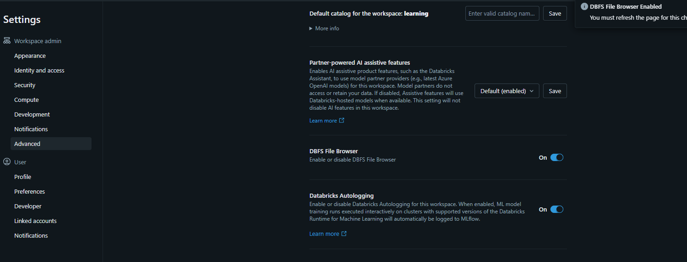

# DataBricks-Complete-Guide
This is a DataBricks Complete Guide by LinkedIn Course. All the example codes with instructions and a Capstone project which commited here


what is databrick? 

it is a cloud-based platform, built on Apache Spark, can be integrated with aws, azure, gg cloud 

feature: 

Unified platform: de, da, ds all in one 

Apache Spark integration 

Key Components : 

Workspace: có notebook, lib, dashboard, 

Cluster: cần bao nhiêu có bấy nhiêu, thoải mái scale

Databrick notebook: 

Jobs: task scheduler cho ETL task , ML task 

Databrick Runtime: là một phiên bản được tối ưu của Apache Spark với nhiều tính năng được thêm vào. đại khái là run trên Spark. 

Delta Lake: quản lý asset transaction 

Unity catalog: được sử dụng để quản lý data (data government) 

Use Cases: 

DE 

DS and machine learning 

Business intelligence and analytics

Data lakehouse 

Real-time analytics : spark stream 

Limitation: 

Cost

Dependency on cloud provides: depend on aws, gg cloud , azure 

Notebook không thể tự chạy được, cần có một cái compute, vào compute để tạo một compute cluster 

What is DBFS (databrick file system ): là trái tim của databrick 

là một hệ thống distributed data file system. được build trên cloud storage( such as azure data lake storage, amazon s3, gg cloud storage) 

key feature of DBFS: 

Unified interface (UI)

use basic command like linux

highly scalable and distributed (nhiều TB ok hết)

data luôn ở đó 

multiple layers 

workspace storage 

DBFS Path Structure: like unix, begin with / 

example: /mnt/data/sample.csv 

relative path: 

DBFS prefix : access programmatically using ” dbfs:/ “ prefix 

Use cases: 

Data loading : read file then transform it to dataframe , dbfs wil do it 

data writing, …. 

limitation: depend on cloud storage, path retrictation

Sau khi upload file lên dbfs cần bật options (DBFS file browser) trong setting để xem được file ở trong catalog



Chọn catalog , sau đó f5 hoặc bấm catalog explorer để nó hiện ra nút browser DBFS 


trong notebook , gõ %fs , thì từ đó nó sẽ hiểu là command vào file system, sau đó mình sẽ dùng command như trong linux 


Transform data with pyspark 

```python
from pyspark.sql.functions import col, column 

df1 = df.filter(df["customer_type"] == "VIP")
df2 = df.filter(col("customer_type") == "Regular")
df3 = df.filter(column("customer_type") == "Premium")
df4 = df.filter(df.customer_type == "Premium")
df4 = df.filter((df.customer_type == "Premium") & (df.country == "USA"))
df6 = df.where((df.customer_type == "Premium") & (df.country == "USA"))
```

```python
df = df.withColumn("Salary", col("age")*1000)
display(df)

df2 = df.withColumn("Seniority", when(col("age") > 30, "Senior").otherwise("Junior"))

display(df2)
```

```python
df3 = df2.withColumnRenamed("Seniority", "Is_Senior")
display(df3)
df4 = df3.drop("Is_Senior")
df5 = df3.drop("Is_Senior", "age", "gender")
display(df4)
df5.printSchema()
```

Null handle 

```python
from pyspark.sql.functions import col
print(df.count()) 
df1 = df.na.drop() # drop all row that have at leastest 1 null value in any column
print(df1.count())

df2 = df.filter(col("email").isNull())
display(df2)
df3 = df.na.fill("Unknown") # fill all null value with Unknown 
df4 = df.na.fill({"email": "Unknown", "age": 0}) # file column email null value with Unknown, age with 0
df5 = df.fillna({"email": "Unknown", "age": 0})
display(df4.where("age == 0 "))
df.printSchema()

display(df.where(col("age").isNull()))

display(df5)
```

work with groupBy

```python
from pyspark.sql.functions import sum, max, min, avg
df1 = df.groupBy("gender").count()
df2 = df.groupBy("gender" , "customer_type").count()
df3 = df.groupBy("gender").sum("age")
df4 = df.groupBy("gender").max("age")
df5 = df.groupBy("gender").min("age")
df6 = df.groupBy("gender").avg("age")
df7 = df.groupBy("gender").agg(sum("age").alias("Sum"), max("age").alias("Highest"), min("age").alias("Lowest"), avg("age").alias("Average"))
display(df7)
```

Handle String 

```python
from pyspark.sql.functions import upper, lower, rtrim, ltrim, trim, regexp_replace, contains, length, concat_ws  
df1 = df.select(upper("country"))
df2 = df.select(lower("country"))
df3 = df.select(ltrim("country").alias("New_Country"), rtrim("country"), trim("country"))
df4 = df.select(regexp_replace(col("country"), "Unknown" , "Not Sure" ).alias("regex_replace_country"))

df5 = df.select("email", col("email").contains("customer"))
df7 = df.select("email", length("email"))
df8 = df.select(concat_ws("@@", "age", upper("country")).alias("concat_age_country"))  # concat with seperator
display(df8)

```

Date handling 

Spark SQL 

A module in Apache Spark that  provides structured data processing using a SQL-like interface 

Key features : 

SQL query interface 

Access from Structured Data, semi structured data, non structure data

integration with dataframe api 

cataliyst optimizer 

support for schema enforcement 

Why use spark sql 

ease of use 

scalability 

integration with big data ecosystem 

performance 

flexibility

Limitation 

latency for small queries 

Complexity for advanced operations (trong 1 số trường hợp phân tích phức tạp, có thể sẽ dùng dataframe thay cho spark sql )

dependency on sparkSession

USING SPARK SQL 

Temporary Views 

chỉ tồn tại trong cái session đó thôi, end là tự destroy

session-scoped : exists only during the current session 

sql queries: enables querying DataFrames using sql 

in memory: not stored on disk or persisted 

transient: automatically dropped when the session ends 

why use temporary views: 

ad hoc analysis : quickly run sql queries 

bridge between pyspark and sql : use sql for transformations 

intermediate results: for etl operations

limitations: 

lost when the session ends 

not for long-term storage 

no indexes for faster queries 

Global temporary views 

có thể được chia sẻ qua nhiều notebook, được lưu thông tin trong một database là global_temp, tồn tại trong cho đến khi cluster shutdown mới mất

key features: 

Application-wide: accessible across all sessions in a Spark application 

Stored in global_temp database 

Transient: dropped when the Spark application ends 

Nonpersistent: data is not stored in the metastore or on disk 

spark.sql(”select * from views11”) return a dataframe, so can you pyspark as usual

Managed Table 

Managed Table contain both data and metadata of itself 

advantages: 

giống y chang một cái table trong database vậy

External Table 

external table in DBrick is a table in which the metadata is managed by the Databricks metastore, and the data resides in an external storage location(such as azure data lake, amazon s3, or dbfs). the data is not moved or managed by databricks, instead, it remains in its original location 

key features : 

the table refers to data stored in an external location 

metadata is stored in the databricks metastore 

dropping an external table removes only the metadata; the data remains intact in the external location 

supports various file formats, including Parquet, Delta, CSV, Json, and more 

advantages: 

data independencs 

shared access 

flexible data formats 

integration with data lake 

Delta lake 

ACID transactions 

Use cases : 

ETL pipelines : reliable data ingestion with ACID guarantees 

Streaming and batch: unified processing for real-time and historical data 

Data warehousing: supports complex queries and analytics 

```python
display(spark.sql("show tables"))
df.write.mode("overwrite").format("delta").saveAsTable("retaildb.customer_delta")
df1 = spark.sql('insert into retaildb.customer_delta values(1001, "Deepak goyal","deepakgoyal@gmail.com","India","Premium", current_date(), 35, "male", 10000, current_timestamp)')
# you can do insert, update, delete in delta lake 
# show the version of table ( delta lake store the history of table at each time the table change)
display(spark.sql("describe history retaildb.customer_delta"))
df1 = spark.sql("select * from retaildb.customer_delta version as of 0")
display(df1)
# use version or timestamp, timestamp >= timestamp of version that you want to restore 
df2 = spark.sql("select * from retaildb.customer_delta timestamp as of '2025-08-27T10:48:30.000+00:00' ")

spark.sql("RESTORE retaildb.customer_delta to version as of 1 ")
spark.sql("RESTORE retaildb.customer_delta to timestamp as of '2025-08-27T10:48:30.000+00:00' ")

```

Joins : 

```python
df_right = df1.join(df2, on='customer_id', how = "right")
display(df_left)
df_left = df1.join(df2, on='customer_id', how = "left")
display(df_left)
df_outter = df1.join(df2, on='customer_id', how = "outter")
display(df_left)
df_inner = df1.join(df2, on='customer_id', how = "inner")
display(df_left)

```

Broadcast Join 

1 trong 2 df (cái nhỏ hơn) được broadcased (copied) to each worker node to improve performance 

when to use Broadcast join 

The smaller DataFrame fits in the memory of the executor nodes 

you want to reduce shuffle and improve performance for joins 

Use cases: 

Dimension table joins: joining a large fact table with a small dimension table (for example, lookup tables) 

Filtering with small data: filtering a large dataset using a small list of IDs or keys 

Skewed joins: handling data skew when one table is much smaller 

Limitations: 

The size of the smaller DataFrame must be less than the available memory on each executor 

```python
from pyspark.sql.functions import broadcast
df3 = df1.join(broadcast(df2), on='customer_id', how = "inner")
df3.explain() # see the physical plan to know how the broadcast work

```